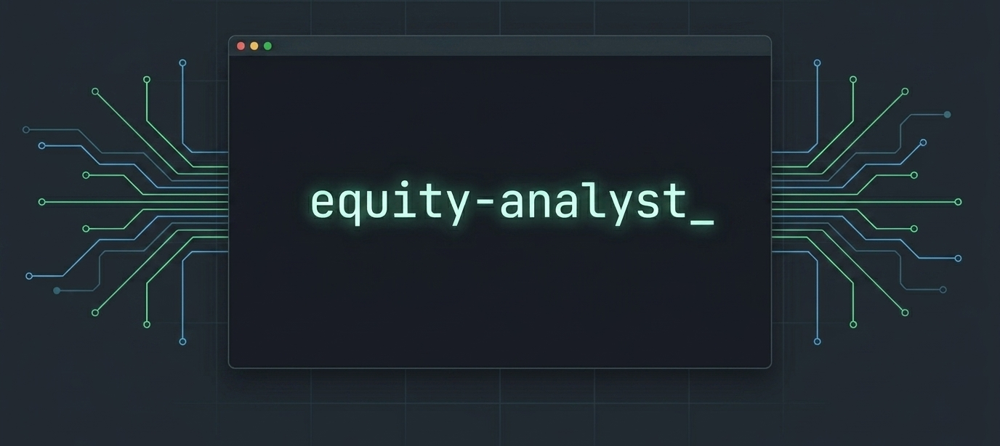

<div align="center">



<br/>

**AI-powered stock portfolio analysis for OpenCode and Claude Code.**  
Skill files · Configurable model routing · Permission-bounded agents · Optional notifications

<br/>

[](OPENCODE.md)
[](https://claude.ai/code)
[](OPENCODE.md)
[](LICENSE)

</div>

---

equity-analyst runs a structured, multi-agent investment research workflow directly in your terminal. Each week you paste in your portfolio — holdings, watchlist, and available cash — and it returns a complete analysis: market regime classification, scored fundamental research on existing positions and new opportunities, technical entry/exit assessment, and concrete portfolio decisions with position sizes. Between weekly runs you can use standalone commands to preview upcoming earnings, review results after they drop, check absolute valuation against peers and a DCF, or scan the next four weeks for binary events across your whole book.

The plugin is built around a strict separation of concerns: nine skill files define the analytical logic, commands provide thin entry points, and permission-bounded agents keep analyst work read-only while only the portfolio manager can use optional notification tools.

> **Disclaimer:** This plugin is a personal research tool, not financial advice. All output — scores, recommendations, price targets, and verdicts — is generated by AI models from publicly available data and is provided for informational purposes only. It may be incomplete, delayed, or incorrect. Nothing produced by this plugin constitutes a buy or sell recommendation, investment advice, or an offer to buy or sell any security. Always do your own research and consult a qualified financial adviser before making any investment decision. Past performance is not indicative of future results.

---

## Installation — OpenCode

The OpenCode version is provider-native: Gemini, Ollama, OpenAI, Anthropic, and other providers are configured as normal OpenCode models per agent. MCP is only needed for optional external tools such as Slack/Telegram/Gmail notifications.

### Local development install

```bash
git clone https://github.com/joaroo/equity-analyst.git
cd equity-analyst
bun install
bun run build
```

Add the local plugin to your OpenCode config:

```jsonc
// ~/.config/opencode/opencode.json
{
  "plugin": ["file:///absolute/path/to/equity-analyst"]
}
```

For this repo on Joaroo's machine:

```jsonc
{
  "plugin": ["file:///Users/joaroo/Projects/llm-stock-analysis"]
}
```

### Package install

After publishing as an npm/bun package:

```bash
bunx equity-analyst-opencode install
```

### OpenCode model config

Create `~/.config/opencode/equity-analyst.jsonc`:

```jsonc
{
  "$schema": "https://unpkg.com/equity-analyst-opencode@latest/equity-analyst.schema.json",
  "preset": "balanced",
  "agents": {
    "marketSnapshot": {
      "model": "google/gemini-3-flash-preview"
    },
    "fundamentalAnalyst": {
      "model": "anthropic/claude-sonnet-4.5",
      "variant": "high"
    },
    "technicalAnalyst": {
      "model": "openai/gpt-5.4-mini"
    },
    "portfolioManager": {
      "model": "openai/gpt-5.5",
      "variant": "high",
      "mcps": ["notifications"]
    },
    "formatter": {
      "model": "ollama/qwen2.5:7b"
    }
  },
  "tools": {
    "notifications": { "mcp": "slack", "tool": "slack_post_message" }
  }
}
```

Project-local overrides are also supported at:

```txt
.opencode/equity-analyst.jsonc
```

See [`OPENCODE.md`](OPENCODE.md) for the current prototype notes.

---

## Installation — Claude Code

The Claude Code version remains available through the Claude plugin marketplace and uses the legacy connector setup in `.mcp.json`.

```bash
# Add the marketplace
claude plugin marketplace add joaroo/equity-analyst

# Install the plugin
claude plugin install equity-analyst@joaroo
```

Claude Code connector setup:

| Alias | Provider | Purpose | Setup |
|-------|----------|---------|-------|
| `market-data` | Gemini MCP | Prices, ratings, earnings, macro | [connectors/gemini/](connectors/gemini/CONNECTOR.md) |
| `local-inference` | Ollama MCP | Portfolio extraction, formatting | [connectors/ollama/](connectors/ollama/CONNECTOR.md) |
| `notifications` | Configurable MCP | Progress updates, report delivery | [connectors/slack/](connectors/slack/CONNECTOR.md) |

See [`.mcp.json.example`](.mcp.json.example) for a complete Gemini + Ollama + Slack wiring.

---

## Commands

| Command | Description |
|---------|-------------|
| `/analyze` | Full weekly pipeline — market snapshot + fundamentals + technicals + portfolio decisions |
| `/snapshot` | Market regime only — RISK-ON / TRANSITIONAL / RISK-OFF as compact JSON |
| `/index-funds` | Monthly index fund analysis — performance, allocation, rebalancing |
| `/earnings-preview TICKER` | Pre-earnings — consensus estimates, scenarios, options-implied move |
| `/earnings-review TICKER` | Post-earnings — beat/miss table, guidance, thesis impact, action |
| `/catalyst-calendar` | 4-week event scan — earnings, FDA, FOMC, HIGH/MEDIUM/LOW risk tiers |
| `/valuation TICKER` | Peer comps + DCF → intrinsic value range, Cheap / Fair / Expensive verdict |

---

## Pipeline

```
User Input
    │
    ├── portfolio-extractor (configured model) ──┐
    ├── market-snapshot    (configured model) ───┤  Phase 0 — parallel
    └── catalyst-scanner   (configured model) ───┘
                │
    fundamental-analyst    (configured model)     Phase 1
                │
    technical-analyst      (configured model)     Phase 2
                │
    portfolio-manager      (configured model)     Phase 3
                │
    format-notification    (configured model)     Phase 4
                │
          Optional notification delivery
```

**Subagent permission boundaries**

| Agent | Access | OpenCode default |
|-------|--------|------------------|
| `equity-portfolio-extractor` | read-only | provider model only |
| `equity-market-snapshot` | read-only | provider model only |
| `equity-catalyst-calendar` | read-only | provider model only |
| `equity-fundamental-analyst` | read-only | provider model only |
| `equity-technical-analyst` | read-only | provider model only |
| `equity-portfolio-manager` | notify only | provider model + optional `notifications` MCP |

Only `equity-portfolio-manager` can trigger notifications by default. All analyst agents are read-only.

---

## Analysis Capabilities

<details>
<summary><strong>Market regime classification</strong></summary>

RISK-ON / TRANSITIONAL / RISK-OFF based on S&P 500 vs moving averages, VIX level, sector leadership, and Fed stance. All downstream scoring weights adapt to the classified regime — deployment targets range from 70–100% cash deployment in Risk-On to 30–50% in Risk-Off.

</details>

<details>
<summary><strong>Fundamental analysis</strong></summary>

Mandatory discovery of 3–5 new stocks per run. Scores existing holdings and watchlist on a 1–10 scale. Regime-adjusted deployment targets and fractional share position sizing.

</details>

<details>
<summary><strong>Technical analysis</strong></summary>

Chart setup (price vs 20/50/200-day MAs), momentum (RSI, MACD, volume), support/resistance levels, entry quality scoring. Binary event handling: earnings within 3 days scores `timing: 3–4/10` with a separate flag — not a global score collapse.

Formula: `(Trend × 0.30) + (Momentum × 0.25) + (Entry × 0.30) + (Timing × 0.15)`

</details>

<details>
<summary><strong>Portfolio management — combined score weights</strong></summary>

| Stock Type | Risk-On | Transitional | Risk-Off |
|------------|---------|--------------|----------|
| Growth | 35% Fund / 65% Tech | 45% / 55% | 60% / 40% |
| Value | 55% Fund / 45% Tech | 60% / 40% | 70% / 30% |

Decisions: Strong Buy · Binary Event Special Case · Conditional · Skip. P&L-tiered hold/trim/add/exit logic.

</details>

<details>
<summary><strong>Earnings preview</strong></summary>

Consensus estimates (EPS, revenue, key sector metrics), bull/base/bear scenario framework, options-implied move, last 4 quarters of historical earnings reactions. Output: Enter Before / Wait for Result / Avoid.

</details>

<details>
<summary><strong>Earnings review</strong></summary>

Actuals vs estimates, guidance assessment (Raised / Maintained / Lowered / Withdrawn), analyst reactions within 48h, thesis impact (Strengthened / Neutral / Weakened), updated fundamental score, action recommendation (Hold / Add / Trim / Exit).

</details>

<details>
<summary><strong>Catalyst calendar</strong></summary>

4-week forward scan across all holdings and watchlist. Event types: earnings, FDA PDUFA, product launches, FOMC, CPI, NFP. Risk tiers: HIGH (binary outcome) · MEDIUM (directional) · LOW (sentiment). High-risk windows flagged when 2+ HIGH events fall within 5 days. Fed into `/analyze` Phase 0 so `portfolio-manager` receives pre-fetched event context.

</details>

<details>
<summary><strong>Valuation</strong></summary>

Peer comps table (4–5 comparable companies): EV/EBITDA, P/E, EV/Revenue, P/S. Simplified 3-scenario DCF (bull/base/bear, 10% WACC, 3% terminal growth). Output: intrinsic value range, current price vs central estimate, Cheap / Fair / Expensive verdict.

</details>

---

## Providers and Tools

### OpenCode

OpenCode model routing replaces the old Gemini/Ollama MCP inference layer. Assign models per agent in `equity-analyst.jsonc`:

```jsonc
{
  "agents": {
    "marketSnapshot": { "model": "google/gemini-3-flash-preview" },
    "fundamentalAnalyst": { "model": "anthropic/claude-sonnet-4.5" },
    "formatter": { "model": "ollama/qwen2.5:7b" }
  }
}
```

Optional MCP tools are configured separately:

```jsonc
{
  "tools": {
    "notifications": { "mcp": "slack", "tool": "slack_post_message" }
  }
}
```

### Claude Code

Claude Code keeps the legacy connector layer in `.mcp.json`. For notifications, set `NOTIFICATION_MCP_TOOL` to your send tool:

| Provider | `NOTIFICATION_MCP_TOOL` |
|----------|------------------------|
| Slack | `mcp__slack__slack_post_message` |
| Telegram | `mcp__telegram__send_message` |
| Gmail | `mcp__gmail__send_email` |

---

## Currency

All analysis uses each instrument's native trading currency — USD (NYSE/NASDAQ), GBP (LSE), EUR (Euronext), JPY (TSE), AUD (ASX), CAD (TSX). Mixed-currency portfolios are fully supported.

---

## Project Structure

```
.claude-plugin/plugin.json               # Plugin manifest (v2.0.0)
.mcp.json                                # Connector alias registry
.mcp.json.example                        # Concrete wiring: Gemini + Ollama + Slack
package.json                             # OpenCode plugin package
src/                                     # OpenCode plugin wrapper
├── index.ts                             # Plugin config hook
├── agents.ts                            # Agent/model registration
├── commands.ts                          # Slash command registration
├── config.ts                            # OpenCode plugin config loader
└── cli/index.ts                         # Installer/doctor CLI
OPENCODE.md                              # OpenCode prototype docs
equity-analyst.schema.json               # OpenCode config schema
connectors/
├── gemini/CONNECTOR.md                  # market-data — Google AI API key, MCP server
├── ollama/CONNECTOR.md                  # local-inference — local install, model selection
└── slack/CONNECTOR.md                   # notifications reference impl
commands/
├── analyze.md                           # /analyze — full weekly pipeline
├── snapshot.md                          # /snapshot — market regime
├── index-funds.md                       # /index-funds — 401k/IRA analysis
├── earnings-preview.md                  # /earnings-preview TICKER
├── earnings-review.md                   # /earnings-review TICKER
├── catalyst-calendar.md                 # /catalyst-calendar
└── valuation.md                         # /valuation TICKER
skills/
├── fundamental-analysis/SKILL.md
├── technical-analysis/SKILL.md
├── portfolio-management/SKILL.md
├── market-snapshot/SKILL.md
├── index-fund-advisory/SKILL.md
├── earnings-preview/SKILL.md
├── earnings-review/SKILL.md
├── catalyst-calendar/SKILL.md
└── valuation/SKILL.md
managed-agent-cookbooks/
├── weekly-portfolio-review/             # /analyze pipeline (6 subagents)
├── index-fund-advisor/
├── earnings-preview/
├── earnings-review/
├── catalyst-calendar/
└── valuation/
```

Skills are the source of truth for all analytical logic. Commands are thin entry points. `src/` registers the OpenCode plugin wrapper. `.claude-plugin/`, `.mcp.json`, `connectors/`, and `managed-agent-cookbooks/` preserve the Claude Code / Anthropic Managed Agents setup.
