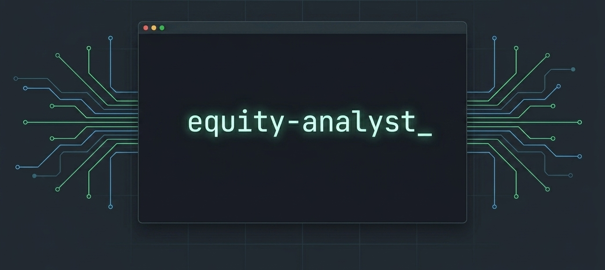

<div align="center">



<br/>

**AI-powered stock portfolio analysis as a Claude Code plugin.**  
Skill files · Governed connectors · Permission-bounded subagents · Managed agent templates

<br/>

[](https://claude.ai/code)
[](LICENSE)

</div>

---

equity-analyst is a Claude Code plugin that runs a structured, multi-agent investment research workflow directly in your terminal. Each week it reads your portfolio from your broker (or you paste in holdings, watchlist, and available cash) and returns a complete analysis: market regime classification, scored fundamental research on existing positions and new opportunities, technical entry/exit assessment, and concrete portfolio decisions with position sizes. Between weekly runs you can use standalone commands to preview upcoming earnings, review results after they drop, check absolute valuation against peers and a DCF, or scan the next four weeks for binary events across your whole book.

The plugin is built around a strict separation of concerns: nine skill files define the analytical logic, connector aliases define where each kind of data comes from — prices and indicators from structured market data, fundamentals and news from web search, labelled as such — and permission-bounded subagents ensure analyst agents can only read while only the portfolio manager can write — to your notification channel of choice.

> **Disclaimer:** This plugin is a personal research tool, not financial advice. All output — scores, recommendations, price targets, and verdicts — is generated by AI models from publicly available data and is provided for informational purposes only. It may be incomplete, delayed, or incorrect. Nothing produced by this plugin constitutes a buy or sell recommendation, investment advice, or an offer to buy or sell any security. Always do your own research and consult a qualified financial adviser before making any investment decision. Past performance is not indicative of future results.

---

## Installation

```bash
# Add the marketplace
claude plugin marketplace add joaroo/equity-analyst

# Install the plugin
claude plugin install equity-analyst@joaroo
```

---

## Commands

| Command | Description |
|---------|-------------|
| `/analyze` | Full weekly pipeline — market snapshot + fundamentals + technicals + portfolio decisions |
| `/snapshot` | Market regime only — RISK-ON / TRANSITIONAL / RISK-OFF as compact JSON |
| `/index-funds` | Monthly index fund analysis — performance, allocation, rebalancing |
| `/earnings-preview TICKER` | Pre-earnings — consensus estimates, scenarios, options-implied move |
| `/earnings-review TICKER` | Post-earnings — beat/miss table, guidance, thesis impact, action |
| `/catalyst-calendar` | 4-week event scan — interim reports, regulatory decisions, Riksbank/ECB/FOMC, HIGH/MEDIUM/LOW risk tiers |
| `/valuation TICKER` | Peer comps + DCF → intrinsic value range, Cheap / Fair / Expensive verdict |

---

## Pipeline

```
portfolio connector (broker) or pasted input
    │
    orchestrator builds portfolio JSON
    │
    ├── market-snapshot    ──┐  Phase 0 — parallel
    └── catalyst-scanner   ──┘
                │
    fundamental-analyst        Phase 1
                │
    technical-analyst          Phase 2
                │
    portfolio-manager          Phase 3
                │
    deliver report             Phase 4 — orchestrator
                │
     response (+ optional notification)
```

**Subagent permission boundaries**

| Subagent | Access | Connector |
|----------|--------|-----------|
| orchestrator | read-only (read tools only) | `portfolio` |
| `market-snapshot` | read-only | `quotes`, `indicators`, `history`, `research` |
| `catalyst-scanner` | read-only | `research` |
| `fundamental-analyst` | read-only | `quotes`, `indicators`, `fx`, `research` |
| `technical-analyst` | read-only | `quotes`, `indicators`, `history`, `research` |
| `portfolio-manager` | read-only | `quotes`, `fx` |

Subagents live in [`agents/`](agents/) and run as `equity-analyst:<name>`. All of them are read-only; only the orchestrator reads the broker (holdings, cash, watchlist) and sends notifications, which are optional — without `NOTIFICATION_MCP_TOOL` the report is simply returned in the session. Block the broker connector's write tools in your client's connector settings as well.

---

## Analysis Capabilities

<details>
<summary><strong>Market regime classification</strong></summary>

RISK-ON / TRANSITIONAL / RISK-OFF from six signals: OMX Stockholm 30, STOXX Europe 600 and S&P 500 vs their moving averages, VIX, European sector leadership, and Riksbank/ECB/Fed stance (home market decides ties). All downstream scoring weights adapt to the classified regime — deployment targets range from 70–100% cash deployment in Risk-On to 30–50% in Risk-Off.

</details>

<details>
<summary><strong>Fundamental analysis</strong></summary>

Mandatory discovery of 3–5 new stocks per run. Scores existing holdings and watchlist on a 1–10 scale. Regime-adjusted deployment targets and fractional share position sizing.

</details>

<details>
<summary><strong>Technical analysis</strong></summary>

Chart setup (price vs 20/50/200-day MAs), momentum (RSI, MACD, volume), support/resistance levels, entry quality scoring. Binary event handling: earnings within 3 days scores `timing: 3–4/10` with a separate flag — not a global score collapse.

Formula: `(Trend × 0.30) + (Momentum × 0.25) + (Entry × 0.30) + (Timing × 0.15)`

</details>

<details>
<summary><strong>Portfolio management — combined score weights</strong></summary>

| Stock Type | Risk-On | Transitional | Risk-Off |
|------------|---------|--------------|----------|
| Growth | 35% Fund / 65% Tech | 45% / 55% | 60% / 40% |
| Value | 55% Fund / 45% Tech | 60% / 40% | 70% / 30% |

Decisions: Strong Buy · Binary Event Special Case · Conditional · Skip. P&L-tiered hold/trim/add/exit logic.

</details>

<details>
<summary><strong>Earnings preview</strong></summary>

Consensus estimates (EPS, revenue, key sector metrics), bull/base/bear scenario framework, options-implied move, last 4 quarters of historical earnings reactions. Output: Enter Before / Wait for Result / Avoid.

</details>

<details>
<summary><strong>Earnings review</strong></summary>

Actuals vs estimates, guidance assessment (Raised / Maintained / Lowered / Withdrawn), analyst reactions within 48h, thesis impact (Strengthened / Neutral / Weakened), updated fundamental score, action recommendation (Hold / Add / Trim / Exit).

</details>

<details>
<summary><strong>Catalyst calendar</strong></summary>

4-week forward scan across all holdings and watchlist. Event types: interim reports, regulatory decisions (FDA/EMA), product launches, Riksbank/ECB/FOMC meetings, Swedish/euro-area/US inflation and US jobs data. Risk tiers: HIGH (binary outcome) · MEDIUM (directional) · LOW (sentiment). High-risk windows flagged when 2+ HIGH events fall within 5 days. Fed into `/analyze` Phase 0 so `portfolio-manager` receives pre-fetched event context.

</details>

<details>
<summary><strong>Valuation</strong></summary>

Peer comps table (4–5 comparable companies): EV/EBITDA, P/E, EV/Revenue, P/S. Simplified 3-scenario DCF (bull/base/bear, 10% WACC, 3% terminal growth). Output: intrinsic value range, current price vs central estimate, Cheap / Fair / Expensive verdict.

</details>

---

## Data Connectors

Defined in `connectors.json`. Skills reference aliases only — real tool names live in subagent YAMLs.

| Alias | Provider | Purpose | Setup |
|-------|----------|---------|-------|
| `portfolio` | Broker MCP — Montrose or IBKR (unbound by default) | Holdings, cost basis, cash | [connectors/](connectors/README.md#portfolio-provider) |
| `quotes` | Self-hosted market-data MCP | Current prices | [connectors/market-data/](connectors/market-data/CONNECTOR.md) |
| `history` | Self-hosted market-data MCP | Raw OHLCV bars → support/resistance, returns | [connectors/market-data/](connectors/market-data/CONNECTOR.md) |
| `indicators` | Self-hosted market-data MCP | Computed MAs, RSI, MACD, ranges, volume ratios | [connectors/market-data/](connectors/market-data/CONNECTOR.md) |
| `fx` | Self-hosted market-data MCP | ECB exchange rates | [connectors/market-data/](connectors/market-data/CONNECTOR.md) |
| `research` | Built-in WebSearch / WebFetch | Fundamentals, ratings, earnings, guidance, Fed, catalysts | — |
| `notifications` | Optional, configurable | Progress updates, report delivery | [connectors/slack/](connectors/slack/CONNECTOR.md) |

**Where the numbers come from.** Prices, index levels and exchange rates come from structured tools and carry timestamps; moving averages, RSI and MACD are computed server-side, not by the model. Fundamentals, estimates, analyst targets and event dates have no structured source here — they come from web search and are cited as search-derived, so treat scores built on them accordingly.

See [`.mcp.json.example`](.mcp.json.example) for concrete wiring.

**Notification provider (optional)** — set `NOTIFICATION_MCP_TOOL` to your send tool, or leave it unset to get results in the session only:

| Provider | `NOTIFICATION_MCP_TOOL` |
|----------|------------------------|
| Slack | `mcp__slack__slack_post_message` |
| Telegram | `mcp__telegram__send_message` |
| Gmail | `mcp__gmail__send_email` |

---

## Currency

Prices, targets and stops use each instrument's native trading currency (SEK, NOK, DKK, EUR, GBP, USD). Cash, position sizes, portfolio value and P&L use the base currency set in `investor-profile.json` (SEK by default), with foreign returns split into local performance and currency effect.

## Investor Profile

[`investor-profile.json`](investor-profile.json) holds everything country-specific: base currency, account type and its tax rules (Swedish ISK by default — no tax on trades inside the account, annual tax on its value), home, regional and global indices, European sector proxies, central banks, macro releases and position-sizing percentages. Edit it to use the plugin elsewhere; skills do not hardcode these values.

---

## Project Structure

```
.claude-plugin/plugin.json               # Plugin manifest (v2.0.0)
connectors.json                          # Connector alias registry
investor-profile.json                    # Base currency, account/tax rules, markets, sizing
.mcp.json.example                        # MCP server wiring: market-data + broker + Slack
connectors/
├── README.md                            # Aliases and portfolio (broker) providers
├── market-data/CONNECTOR.md             # quotes / history / indicators / fx
└── slack/CONNECTOR.md                   # notifications reference impl
servers/
└── market-data/                         # Self-hosted MCP behind quotes / history / indicators / fx
agents/                                  # Plugin subagents for /analyze (all read-only)
├── market-snapshot.md
├── catalyst-scanner.md
├── fundamental-analyst.md
├── technical-analyst.md
└── portfolio-manager.md
commands/
├── analyze.md                           # /analyze — full weekly pipeline
├── snapshot.md                          # /snapshot — market regime
├── index-funds.md                       # /index-funds — fund portfolio (ISK) analysis
├── earnings-preview.md                  # /earnings-preview TICKER
├── earnings-review.md                   # /earnings-review TICKER
├── catalyst-calendar.md                 # /catalyst-calendar
└── valuation.md                         # /valuation TICKER
skills/
├── fundamental-analysis/SKILL.md
├── technical-analysis/SKILL.md
├── portfolio-management/SKILL.md
├── market-snapshot/SKILL.md
├── index-fund-advisory/SKILL.md
├── earnings-preview/SKILL.md
├── earnings-review/SKILL.md
├── catalyst-calendar/SKILL.md
└── valuation/SKILL.md
managed-agent-cookbooks/
├── weekly-portfolio-review/             # /analyze pipeline (5 subagents)
├── index-fund-advisor/
├── earnings-preview/
├── earnings-review/
├── catalyst-calendar/
└── valuation/
```

Skills are the source of truth for all analytical logic. Commands are thin entry points. Subagent YAMLs declare permissions and tool access. Cookbooks are deployment templates for the Anthropic Managed Agents API.
